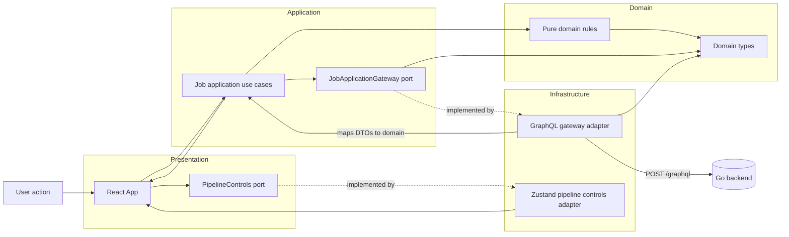
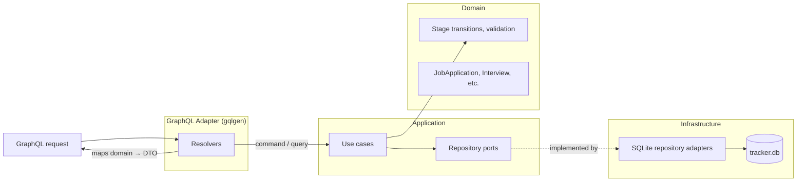
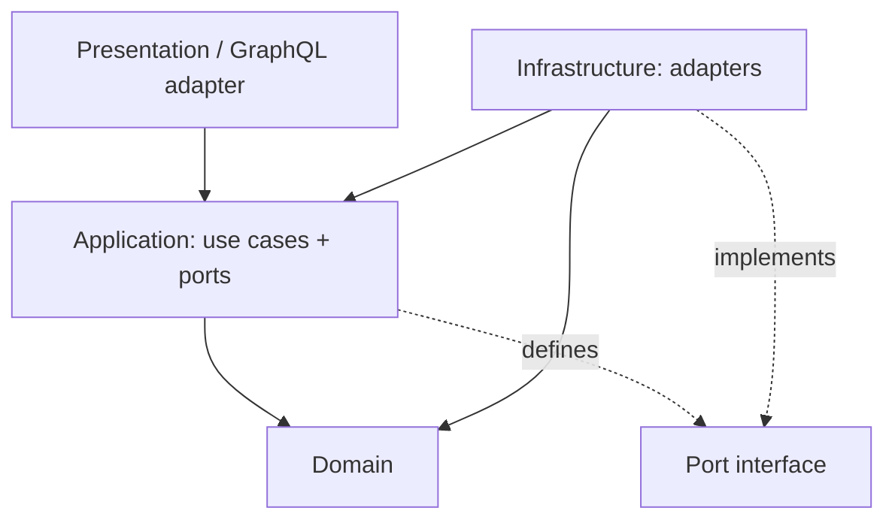

# react-hexagonal-architecture

A toy for practicing hexagonal architecture across a React frontend and a Go backend.

## Workspaces

| Path | Description |
|---|---|
| `apps/web` | React + Vite frontend |
| `apps/api` | Go GraphQL backend |

## Architecture

The system has two deployment units that share only the GraphQL schema as a contract.

### Frontend (`apps/web`)

Ports point inward as interfaces; adapters sit outside and implement them. `main.tsx` wires the concrete adapters into React at startup.



### Backend (`apps/api`)

Follows the same hexagonal architecture: domain → application (use cases + ports) → infrastructure (SQLite adapters) → GraphQL adapter (gqlgen resolvers).



### Dependency direction (both layers)



## Development

### Prerequisites

- Node.js 20+
- Go 1.22+

### Install dependencies

```sh
npm install
```

### Run frontend only (MSW mock backend)

MSW intercepts all GraphQL requests in-process. No Go server needed.

```sh
npm run dev --workspace apps/web
```

### Run frontend against the real Go backend

Start the Go server first:

```sh
cd apps/api
go run ./cmd/api
```

Then start the frontend in production mode (MSW disabled):

```sh
npm run dev:api --workspace apps/web
```

The frontend defaults to `http://localhost:8080/graphql`. Override with `VITE_API_URL` in `.env.local` if your backend runs elsewhere.

### MSW toggle

| Script | `MODE` | MSW | Backend |
|---|---|---|---|
| `npm run dev` | `development` | starts | mock (in-process) |
| `npm run dev:api` | `production` | skipped | Go server on :8080 |

MSW is controlled by `import.meta.env.MODE !== 'production'` in `apps/web/src/main.tsx`. It is not tied to `VITE_API_URL`.

### Run tests

```sh
# Frontend
npm test --workspace apps/web

# Backend
cd apps/api && go test ./...
```

### Build the Go binary

```sh
cd apps/api
go build -o api ./cmd/api
./api
```

See [`apps/api/README.md`](apps/api/README.md) for full backend documentation.
