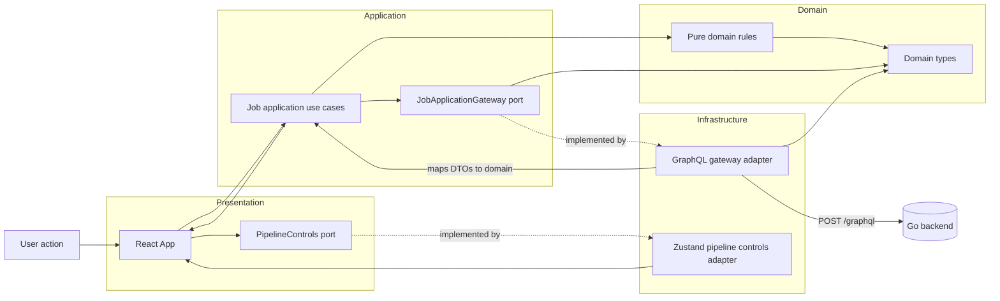
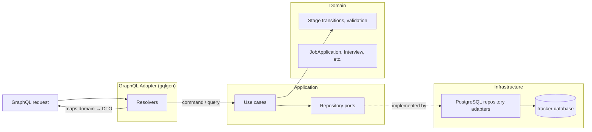
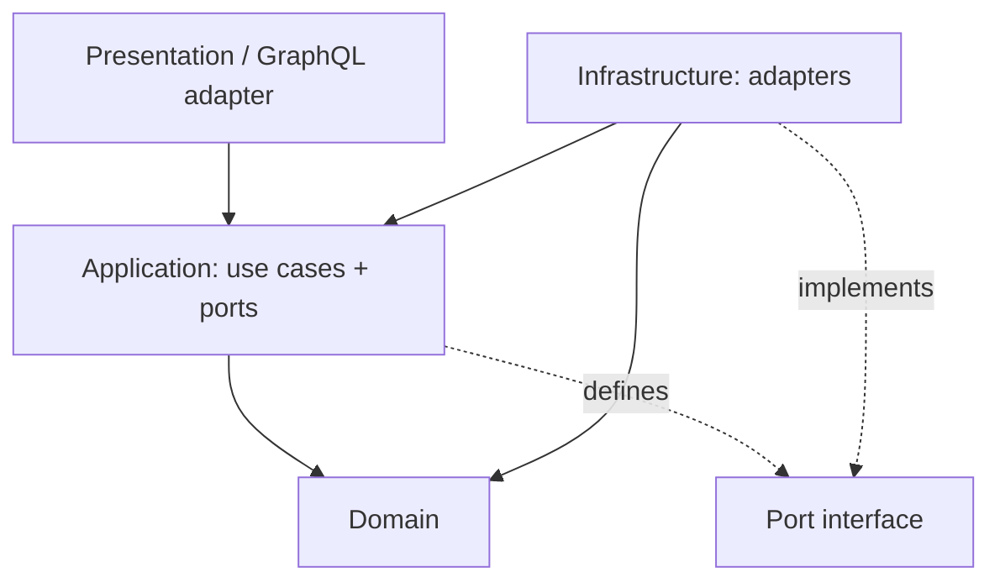

# Career Pipeline

A full-stack job application tracker with a React frontend, Go GraphQL backend, and PostgreSQL persistence.

## Workspaces

| Path | Description |
|---|---|
| `apps/web` | React 19 + Vite frontend |
| `apps/api` | Go GraphQL backend with PostgreSQL persistence |

## Architecture

The system has two deployment units that share only the GraphQL schema as a contract.

Career Pipeline intentionally uses hexagonal architecture to keep domain rules, application use cases, ports, and infrastructure adapters separate across the frontend and backend.

### Frontend (`apps/web`)

Ports point inward as interfaces; adapters sit outside and implement them. `main.tsx` wires the concrete adapters into React at startup.

The frontend uses TanStack Query for server state, Zustand only for presentation control state, and GraphQL Code Generator to type frontend-owned GraphQL operation documents from the backend schema.



### Backend (`apps/api`)

Follows the same hexagonal architecture: domain → application (use cases + ports) → infrastructure (PostgreSQL adapters) → GraphQL adapter (gqlgen resolvers).

The executable entrypoint stays thin. Runtime configuration, database bootstrap, dependency composition, and HTTP server setup live in focused internal modules so `cmd/api/main.go` remains process orchestration rather than a mixed wiring script.



### Dependency direction (both layers)



## Development

### Prerequisites

- Node.js 24.15+ recommended
- Go 1.26+
- Docker, for the local PostgreSQL database

### Quick start

```sh
make help        # list all available targets
make dev         # start full stack: Postgres + API + web (connected to real API)
make test        # run all tests
make build       # build Go binary + Vite production bundle
```

### Install dependencies

```sh
npm install
```

### Run frontend only (MSW mock backend)

MSW intercepts all GraphQL requests in-process. No Go server needed.

```sh
make dev-web
```

### Run frontend against the real Go backend

```sh
make db-up           # start Postgres
make dev-api         # start Go server (terminal 1)
make dev-web-api     # start frontend against real API, MSW disabled (terminal 2)
```

The frontend defaults to `http://localhost:8080/graphql`. Override with `VITE_API_URL` in `.env.local` if your backend runs elsewhere.

### MSW toggle

| Command | `MODE` | MSW | Backend |
|---|---|---|---|
| `make dev-web` | `development` | starts | mock (in-process) |
| `make dev-web-api` | `production` | skipped | Go server on :8080 |

MSW is controlled by `import.meta.env.MODE !== 'production'` in `apps/web/src/main.tsx`. It is not tied to `VITE_API_URL`.

### Run tests

```sh
make test        # both API and web
make test-api    # Go tests only
make test-web    # Vitest only
```

### Generate GraphQL types

```sh
make codegen-web   # generate frontend GraphQL types from the backend schema
make codegen-api   # run Go code generation (gqlgen, sqlc wiring, etc.)
```

The frontend build verifies generated artifacts are current.

### Build

```sh
make build       # both apps
make build-api   # Go binary only → apps/api/bin/api
make build-web   # Vite bundle only → apps/web/dist/
```

See [`apps/api/README.md`](apps/api/README.md) for full backend documentation.

## Docker

Docker is an alternative to the native dev workflow — useful for contributors who don't want to install Go or Node locally. Both modes use the same Dockerfiles with different build targets.

> **Note:** Native and Docker stacks use the same ports (8080, 5173). Don't run both at the same time.

### Development (hot reload)

```sh
make docker-dev    # build images and start postgres + api + web with hot reload
make docker-down   # stop and remove all containers
```

- Go API recompiles automatically on `.go` file changes via `air`
- React frontend updates instantly via Vite HMR
- Source edits on the host reflect inside containers immediately (volume mounts)

### Production smoke testing

```sh
make docker-build  # build production images only (no containers started)
make docker-prod   # build and run production images locally
```

The production stack runs the compiled Go binary (no Go toolchain) and serves the Vite bundle via nginx on port 80. Use this to verify the production images before pushing to a registry.

To deploy, push the images built by `make docker-build` to a container registry (Docker Hub, ECR, GCR, etc.) and run them on any container-capable platform.
