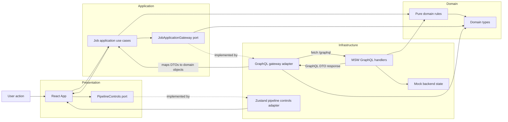
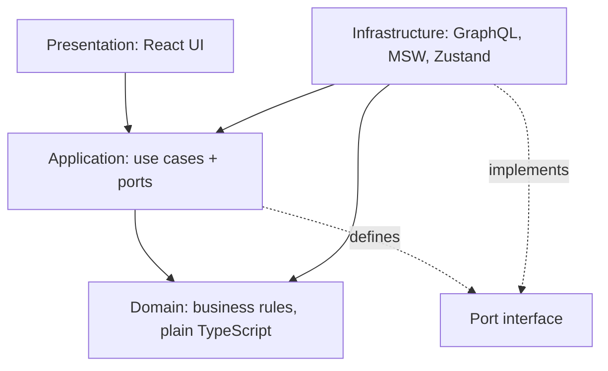
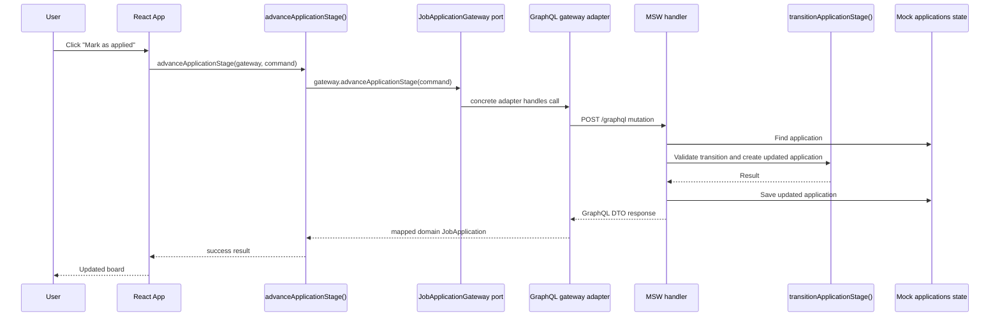

# react-hexagonal-architecture

A toy for practicing about hexagonal architecture

## Architecture Data Flow

Ports point inward as interfaces, adapters sit outside and implement them, and
runtime data flows through the concrete adapter that `main.tsx` wires into
React.



The dependency direction is different from the runtime call direction:



For example, marking an application as applied travels through the app like
this:



The application layer knows only the `JobApplicationGateway` port, not GraphQL
or MSW. That is what lets the mock backend be replaced later without changing
the use cases.

## Development

Install dependencies from the repo root:

```sh
npm install
```

Run the test suite:

```sh
npm test
```

Start the frontend app:

```sh
npm run dev --workspace apps/web
```
